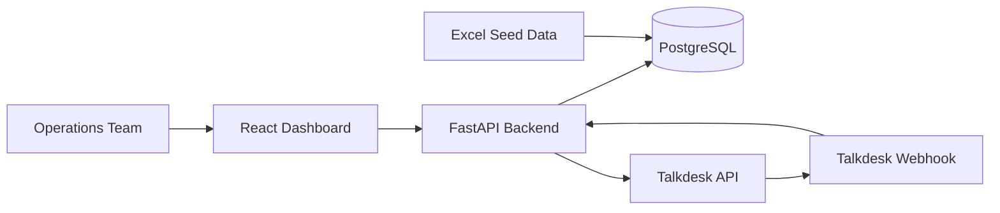

## Problem
I decided to focus on centralizing phone call workflows for ES and OS teams to effectively close patient leads. Each time a phone call is made, the ops teams must manually reconcile two data sources:
1. Call-related information in Salesforce (# of call attempts, call outcome)
2. Granular information from the Talkdesk call log (cross-referenced by Salesforce Opportunity ID)

This process is not only prone to human error but also inefficient for the ops team because there's no central place to know what step to take next for each lead.

## Scope

### In Scope
#### No single system of record to track a lead's statuses end-to-end
- Instead of reconciling two data sources (Salesforce, Talkdesk) per phone call, we can pull Talkdesk call logs directly from our leads tracking app. Based on the implementation in `talkdesk_client.py`, when the lead's status changes in Talkdesk, it will automatically reflect back in the leads tracking app.
- Each ES/OS has a task list of their in progress leads, when they were last contacted in Talkdesk, and how to progress them through the enrollment process.
- There is a dashboard of metrics tracking the total referral volume, in-progress leads, and conversion rate so each team member can track their individual progress.

### Out of Scope
#### Representatives run phone calls differently
According to Talkdesk API docs, outbound calls can only be made as a step within a Talkdesk Studio Workflow (see https://studio.talkdesk.com/docs/make-outbound-call). There is no API endpoint to call them programmatically, hence this should live outside our application. All phone-call related data and actions should live in Talkdesk instead of in Salesforce or our Postgres instance for a single source of truth. This limits the amount of systems, protects patient privacy, and maintains data consistency with fewer systems of record. If this were to change in the future, I've included a `talkdesk_client.py` and `config.py` with boilerplate on how to enable OAuth 2.0 to make calls to any Talkdesk APIs.

#### Referral data being inconsistent across different sources
80% of columns from our mock data (Opportunity_Export.csv) represent information that the Habitat Health Enrollment Specialist (ES) and Outreach Specialist (OS) teams are collecting operationally. I'm assuming the only columns we currently ask our referrals to provide are:
1. Lead First Name
2. Lead Last Name
3. Lead DOB
4. Referral Reason
5. Referring Contact  

The remaining columns in our mock data are updated by our internal ops team to track the progress of a lead.

### Alternatives Considered
I considered building an AI call center agent that ES/OS leads could use alongside their regular Salesforce and Talkdesk workflows. For example, to start their day, the ES/OS could use natural language prompting to ask "which calls need to be made today" or "give me a status update on my in progress leads". The agent would then be able to make calls on behalf of the ES/OS for calls that are designated as AI-led. However, I decided against this approach due to the following:
1. Not having access to a Salesforce or Talkdesk instance
2. Not having a programmatic endpoint to make Talkdesk calls
3. Avoiding adding a new surface area for ES/OS teams to manage  
See more: https://calldesk.ai/blog/blueprint-to-build-ai-call-center

## Success Criteria
- **Primary metric:** Volume of leads processed 
- **Secondary metric:** Lead conversion rate  

## Solution Design
The prototype contains deterministic logic. To start their day, an ES or OS team member would open the leads tracking app, which is essentially a mock Salesforce instance seeded with the data provided. They see their in-progress leads by default, and can view the lead's call history from Talkdesk. When the lead's status changes in Talkdesk, we have a webhook listener set up to update which stage the lead is in so the two systems automatically stay in sync.  

Data flow: Talkdesk Calls -> `seed_data_calls.json` -> PostgreSQL calls table -> GET /leads/{lead_id}/calls -> Display call history in LeadPanel.jsx

A major assumption I made is that agentic AI logic for phone calls would live in Talkdesk. According to their API docs, outbound calls can only be made as a step within a Talkdesk Studio Workflow (https://studio.talkdesk.com/docs/make-outbound-call). I would recommend making the phone call workflow agentic to solve the pain point of agents running phone calls differently. Some phone calls make sense to be initiated by humans and others make sense to be initiated by AI agents. If an in-progress lead misses a phone call, the agent will remember to try again in 24 hours (or after a waiting period). My proposal would be a personalized phone call from the ES/OS for the initial welcome call, and then to have a scripted AI phone call if the lead is unresponsive for 72 hours after the center tour or ES/OS visit.

### How the solution scales
- Data: 
    - Assuming we have Habitat Centers in the state of CA and ES/OS staff managing up to 10K leads at a time, we can keep the data layer relational even as we scale up to 10x more lead volume. 
    - We're using a Postgres database with tables (`leads`, `calls`, `staff`) defined in `models.py` running in a Docker container.

- Frontend:
    - `Leads.jsx` uses memoization to derive the Account Owner list and the owner/view-filtered rows from the fetched leads, so those filters don't get recomputed on every render as the lead volume grows.
    - Tasks are ephemeral, kept in local component state (`Tasks.jsx`) for the current session, so they aren't stored in the database.

- API: 
    - Since we're outsourcing the bulk of the phone call logic to Talkdesk, we don't store Talkdesk call metadata on the lead itself. The "last outreach date" shown in Tasks is derived on demand from the `calls` table, letting the Talkdesk Studio flows run the phone calls.
    - We require `lead_id` before loading call history, so we aren't loading call history for all leads from PostgreSQL.

## Architecture
- `frontend/` — React app (Vite)
    - User can view tasks assigned to them
    - User can view phone call history
    - User can update a lead's status
- `backend/` — FastAPI app (Python)
    - Serves lead data from PostgreSQL (`GET /leads`)
    - Serves lead call history from PostgreSQL (`GET /leads/{lead_id}/calls`)
    - Receives lead status changes from Talkdesk (`POST /webhooks/talkdesk/lead-status`) and syncs them into the `leads` table
    - Handles the Talkdesk OAuth 2.0 client-credentials flow
- `PostgreSQL` — stores lead data
    - Note: if you rename POSTGRES_DB again, either manually create the new database as above, or run `docker compose down -v` to wipe the volume and let Postgres reinitialize from scratch (only do this if you don't need the existing data).



### Getting Started
1. Copy env files and fill in your Talkdesk credentials (kept as placeholder for testing):
   ```
   cp backend/.env.example backend/.env
   cp frontend/.env.example frontend/.env
   ```
2. Start Postgres + backend:
   ```
   docker compose up -d
   ```
   Or run the backend locally:
   ```
   cd backend
   python -m venv .venv && .venv/Scripts/activate
   pip install -r requirements.txt
   uvicorn app.main:app --reload
   ```
3. Seed the `leads` table (only needs to run once):
   ```
   docker compose exec backend python -m app.seed
   ```
4. Start the frontend:
   ```
   cd frontend
   npm install
   npm run dev
   ```

### New integrations
#### Display call tracking status in Salesforce
Note: Similar plugins are offered by Talkdesk - https://support.talkdesk.com/hc/en-us/articles/360042369171-Setting-up-Talkdesk-Dialer-for-Salesforce
When the ES/OS reviews their leads, we will display a call history of mock Talkdesk data per lead. 

### Out of Scope Integrations
#### Keep Propio for live translation
My assumption is that Propio is launched in a separate browser window when the ES/OS make the phone call in Talkdesk. We should continue to utilize this since many leads don't speak English as their primary language, or explore an integration with Talkdesk.

#### Keep the existing Salesforce CRM
I didn't want to transition off the Salesforce CRM platform because that implies we need to create a new CRM integration altogether. The initial user interface uses a mock Salesforce-like dashboard as the single interface for an ES/OS to manage leads. Knowing that Salesforce isn't the most flexible with task-tracking, I decided to narrow the scope to a custom workflow tracker on top of the mocked Salesforce CRM instance. 

#### Keep Epic for patient data
After the lead's LOC application is approved by the DHCS, they convert from a lead into a patient. The patient's medical forms should remain in Epic EHR. This keeps a clean distinction between the use of Salesforce for leads generation and Epic for patient tracking. We want to minimize the amount of sensitive healthcare information by only storing it for leads, and storing it in a HIPAA-compliant system that's meant to contain PHI.